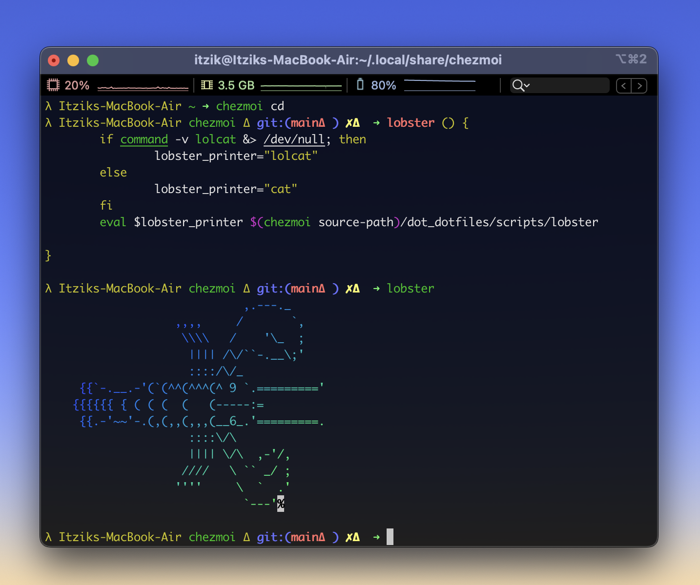

<center>

# PatentLobster's dotfiles.
#### Cross-platform dotfiles Powered by [Chezmoi](https://www.chezmoi.io/)

-----


-----



----
### Installation command:

```
sh -c "$(curl -fsLS https://itz.is/dot)"
```
or
```
sh -c "$(curl -fsLS https://chezmoi.io/get)" -- init --apply https://github.com/patentlobster/dotfiles.git --exclude=encrypted
```
-----


> This Lobster loves his shell.


</center>
