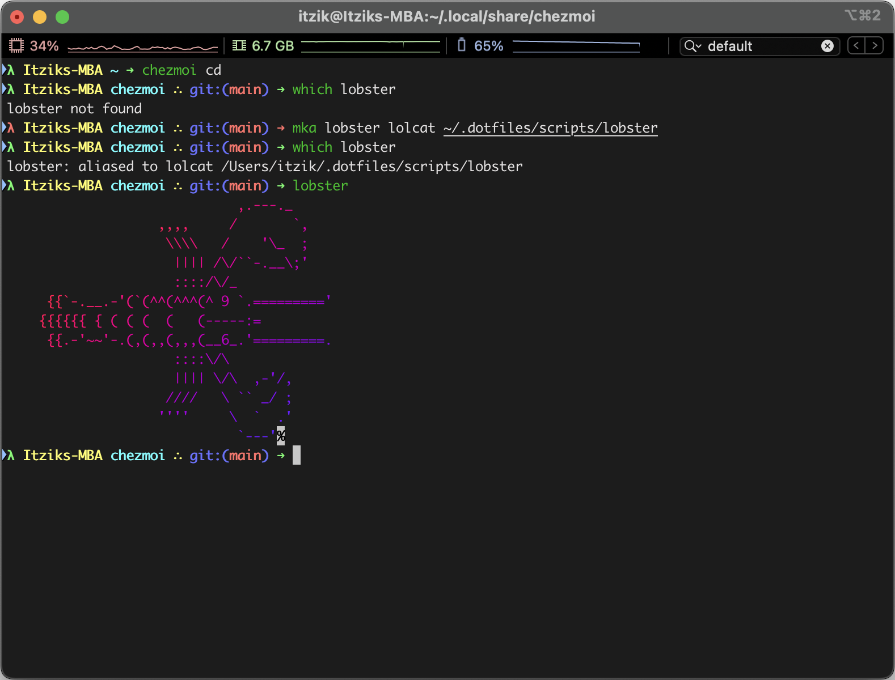

# PatentLobster's dotfiles.
#### Cross-platform dotfiles Powered by [Chezmoi](https://www.chezmoi.io/)

-----



----
### Installation command:

```
sh -c "$(curl -fsLS https://chezmoi.io/get)" -- init --apply https://github.com/patentlobster/dotfiles.git --exclude=encrypted
```
-----


### Contents:

- ZSH
  - [oh-my-zsh](https://github.com/ohmyzsh/ohmyzsh)
  - git-trim
  - zsh-artisan
  - fzf-tab
  - zsh-autosuggestions
  - zsh-syntax-highlighting
- VIM
  - Vundle
  - 'kien/ctrlp.vim' - fuzzy find files
  - 'scrooloose/nerdtree' - file drawer, open with :NERDTreeToggle
  - 'benmills/vimux'
  - 'tpope/vim-fugitive' 
  - 'tpope/vim-commentary'
- TMUX
  - [oh-my-tmux](https://github.com/gpakosz/.tmux)

----


> This Lobster loves his shell.


